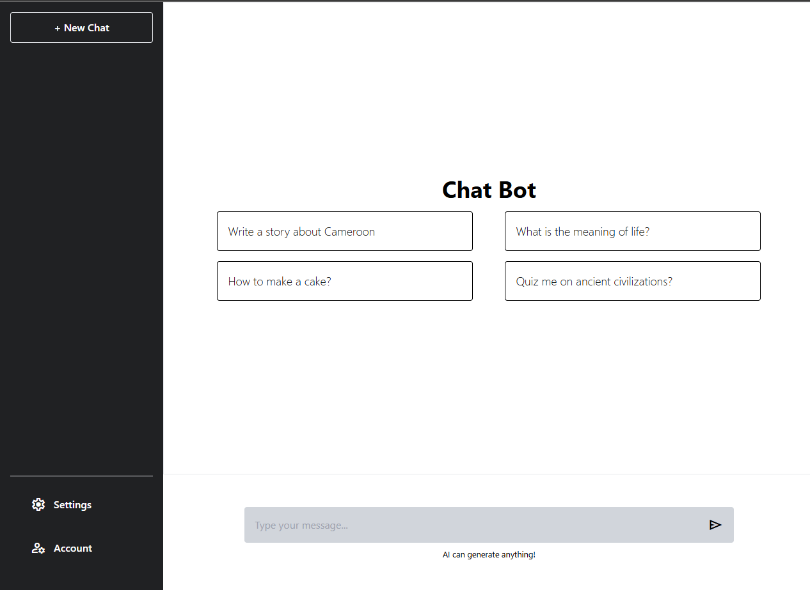
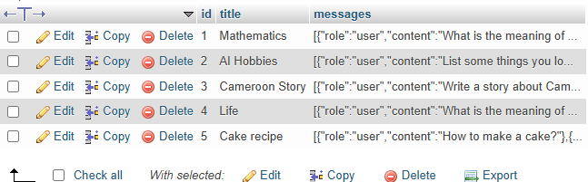

# Chat Application

A simple chat application powered by Google Generative AI, built with React on the frontend and Express on the backend. This application allows users to interact with an AI model in real-time, save chat histories, and manage their chats effectively.

## Features

- **Real-time Chatting**: Users can send messages to the AI and receive responses in real-time.
- **Chat Management**: Users can create, update, and retrieve chat histories.
- **User-Friendly Interface**: An intuitive UI built with React, enabling easy navigation and interaction.

## Frontend

The frontend is developed using React and utilizes `ReactMarkdown` for rendering messages. It supports the following features:

- **Chat Window**: A responsive chat interface that displays user and AI messages.
- **Input Field**: Users can type their messages and submit them.
- **Chat History**: Users can view and manage past conversations.

### Technologies Used

- React
- ReactMarkdown
- CSS and Tailwind CSS for styling

## Backend

The backend is developed using `Express` and `Sequelize`, which connects to a MySQL database. Key features include:

- **Chat API**: Provides REST API Endpoints

  - **POST /api/chat**: Sends user messages to the AI and streams back responses.
  - **GET /api/chats**: Retrieves all saved chats.
  - **PUT /api/chats/:id**: Updates the title and messages of a specific chat.

### Technologies Used

- Express
- Sequelize
- MySQL
- Node.js

## Chatbot Demo

You can watch a demo of the chatbot application below:

Below is the chat bot database of the above demo

## Contributing

Feel free to submit issues and pull requests. Contributions are welcome!
